# Kubeflow Pipelines - GitHub Issue Summarization

[Codelab Feedback](https://github.com/kubeflow/examples/issues/new?title=[codelab-pipelines-gis-feedback]:&labels=area/example/issue_summarization/codelab)

## Introduction
Duration: 5

### __What does a Kubeflow deployment look like?__

A Kubeflow deployment is:

* __Portable__ - Works on any Kubernetes cluster, whether it lives on Google Cloud Platform (GCP), on premises, or across providers.
* __Scalable__ - Can utilize fluctuating resources and is only constrained by the number of resources allocated to the Kubernetes cluster.
* __Composable__ - Enhanced with service workers to work offline or on low-quality networks.

It is a means of organizing loosely-coupled microservices as a single unit and deploying them to a variety of locations, whether that's a laptop or the cloud. This codelab will walk you through creating your own Kubeflow deployment.

<aside class="special">

Looking for more? Check out the  [Kubeflow Examples repo](https://github.com/kubeflow/examples), where the most up-to-date walkthroughs are.
</aside>

### __What you'll build__

In this codelab, you will build a web app that summarizes GitHub issues using Kubeflow Pipelines to train and serve a model. It is based on the walkthrough provided in the  [Kubeflow Examples repo](https://github.com/kubeflow/examples/tree/master/github_issue_summarization). Upon completion, your infrastructure will contain:

* A Kubernetes Engine cluster with default Kubeflow installation
* A pipeline that performs distributed training of a Tensor2Tensor model on GPUs
* A serving container that provides predictions from the trained model
* A UI that interprets the predictions to provide summarizations for GitHub issues
* A notebook that creates a pipeline from scratch using the Kubeflow Pipelines SDK

### __What you'll learn__

The pipeline you will build trains a  [Tensor2Tensor](https://github.com/tensorflow/tensor2tensor/) model on GitHub issue data, learning to predict issue titles from issue bodies. It then exports the trained model and deploys the exported model using  [Tensorflow Serving](https://github.com/tensorflow/serving). The final step in the pipeline launches a web app, which interacts with the TF-Serving instance in order to get model predictions.

* How to set up a  [Kubeflow](https://github.com/kubeflow/kubeflow) cluster using GKE
* How to build and run ML workflows using Kubeflow Pipelines
* How to define and run pipelines from within a Kubeflow JupyterHub notebook

### __What you'll need__

* A basic understanding of  [Kubernetes](https://kubernetes.io/)
* An active  [GCP project](https://cloud.google.com/resource-manager/docs/creating-managing-projects) for which you have Owner permissions
* A  [GitHub](https://github.com/) account
* Access to the Google Cloud Shell, available in the  [Google Cloud Platform (GCP) Console](https://console.cloud.google.com/home/dashboard)

This is an advanced codelab focused on Kubeflow. For more background and an introduction to the platform, see the  [Introduction to Kubeflow](https://www.kubeflow.org/docs/about/kubeflow/) documentation. Non-relevant concepts and code blocks are glossed over and provided for you to simply copy and paste.

## Set up the environment
Duration: 10

### Cloud__ Shell__

Visit the GCP Console in the browser and log in with your project credentials:

Then click the "Activate Cloud Shell" icon in the top right of the console to start up a  [Cloud Shell](https://cloud.google.com/shell/docs/).

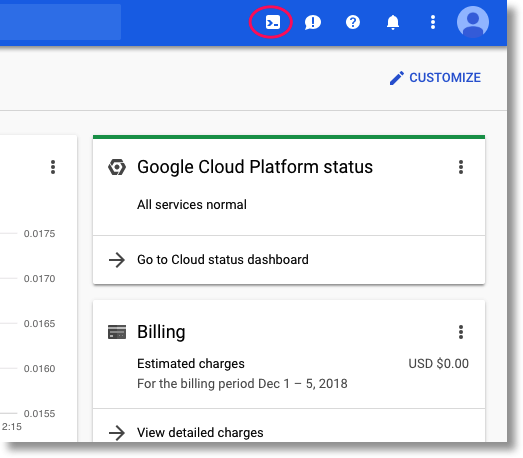

### __Set your GitHub token__

This codelab calls the GitHub API to retrieve publicly available data. To prevent rate-limiting, especially at events where a large number of anonymized requests are sent to the GitHub APIs, set up an access token with no permissions. This is simply to authorize you as an individual rather than anonymous user.

1. Navigate to  [https://github.com/settings/tokens](https://github.com/settings/tokens) and generate a new token with no scopes.
2. Save it somewhere safe. If you lose it, you will need to delete and create a new one.
3. Set the GITHUB_TOKEN environment variable:

    export GITHUB_TOKEN=<token>

### Set your GCP project ID__ and cluster name__

To find your project ID, visit the GCP Console's Home panel. If the screen is empty, click on Yes at the prompt to create a dashboard.

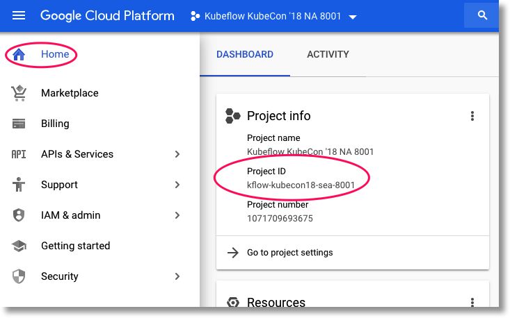

In the Cloud Shell terminal, run these commands to set the cluster name and project ID. __We'll indicate which zone to use at the workshop__.

    export DEPLOYMENT_NAME=kubeflow
    export PROJECT_ID=<your_project_id>
    export ZONE=<your-zone>
    gcloud config set project ${PROJECT_ID}
    gcloud config set compute/zone ${ZONE}

### __Create a storage bucket__

<aside class="special">

__Note: __Bucket names must be unique across all of GCP, not just your organization
</aside>

Create a Cloud Storage bucket for storing pipeline files. Fill in a new, unique bucket name and issue the "mb" (make bucket) command:

    export BUCKET_NAME=kubeflow-${PROJECT_ID}
    gsutil mb gs://${BUCKET_NAME}

Alternatively, you can create a bucket  [via the GCP Console](https://console.cloud.google.com/storage).

### Install the Kubeflow Pipelines SDK

<aside class="special">

__Note: __Python 3.5 or higher is required.
</aside>

Run the following command to install the Kubeflow Pipelines SDK:

    pip3 install https://storage.googleapis.com/ml-pipeline/release/0.1.7/kfp.tar.gz --upgrade

### __Pin useful dashboards__

In the GCP console, pin the __Kubernetes Engine__ and __Storage__ dashboards for easier access.

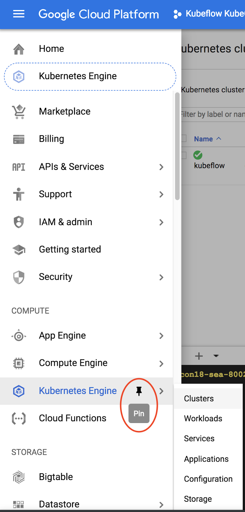

## Create
 a Kubeflow cluster
Duration: 15

### Create a cluster

Create a managed Kubernetes cluster on Kubernetes Engine by visiting the Kubeflow Click-to-Deploy site in your browser and signing in with your GCP account:

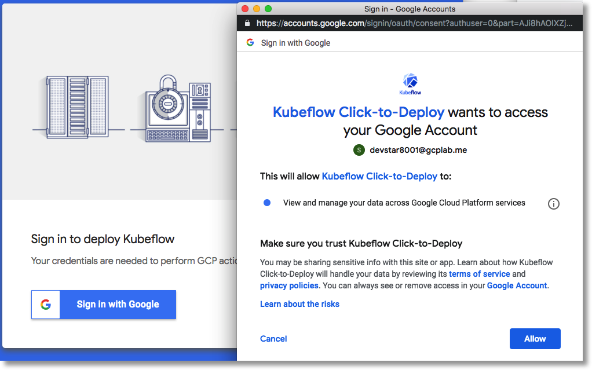

Fill in the following values in the resulting form:

* __Project__: Enter your GCP `$PROJECT_ID` in the top field 
* __Deployment name__: Set the default value to __`kubeflow`__. Alternatively, set `$DEPLOYMENT_NAME` to a different value and use it here. Note that this value must be unique within the project.
* __GKE Zone__: Use the value you have set for `$ZONE`, selecting it from the pulldown.
* __Kubeflow Version__: v0.4.1
* Check the __Skip IAP__ box

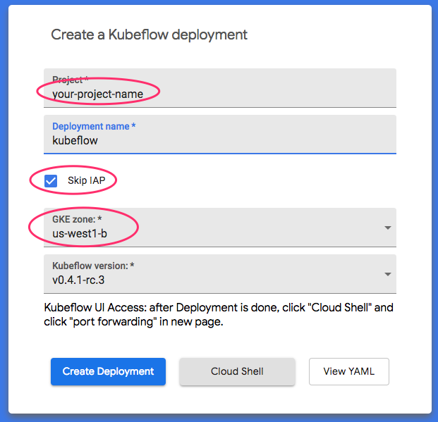

### __Set up kubectl to use your new cluster's credentials__

When the cluster has been instantiated, connect your environment to the Kubernetes Engine cluster by running the following command in your Cloud Shell:

    gcloud container clusters get-credentials ${DEPLOYMENT_NAME} \
      --project ${PROJECT_ID} \
      --zone ${ZONE}

This configures your `kubectl` context so that you can interact with your cluster. To verify the connection, run the following command:

    kubectl get nodes -o wide

You should see two nodes listed, both with a status of "`Ready`", and other information about node age, version, external IP address, OS image, kernel version, and container runtime.

### __Add a GPU node pool to the cluster__

Run the following command to create the accelerator node pool:

    gcloud container node-pools create accel \
      --project ${PROJECT_ID} \
      --zone ${ZONE} \
      --cluster ${DEPLOYMENT_NAME} \
      --accelerator type=nvidia-tesla-k80,count=4 \
      --num-nodes 1 \
      --machine-type n1-highmem-8 \
      --disk-size=220GB \
      --scopes cloud-platform \
      --verbosity error

<aside class="special">

__Note: __This can take up to 3 minutes.
</aside>

Install Nvidia drivers on these nodes by applying a  *daemonset* :

    kubectl apply -f https://raw.githubusercontent.com/GoogleCloudPlatform/container-engine-accelerators/stable/nvidia-driver-installer/cos/daemonset-preloaded.yaml

### __View the Kubeflow central dashboard__

Once the cluster setup is complete, port-forward to view the Kubeflow central dashboard.  Click the "Cloud Shell" button in the launcher:

This will open a tab showing your new cluster's services details. Click the __Port Forwarding__ button towards the bottom of the page, then click the __Run in Cloud Shell__ button in the resulting popup window. 

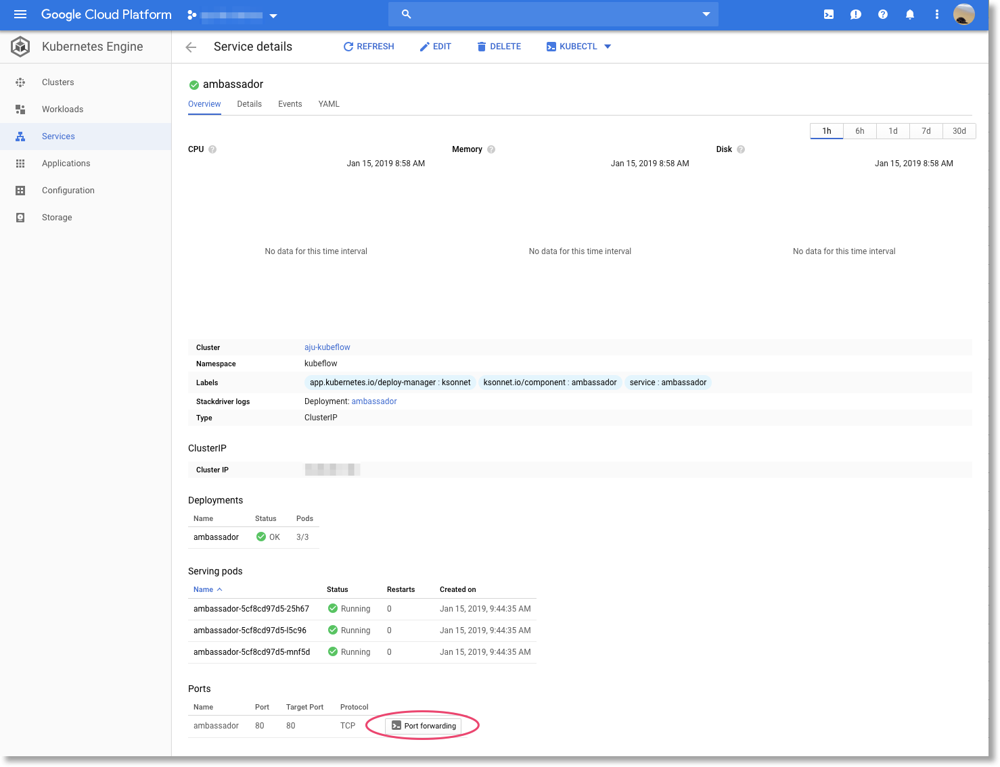

A Cloud Shell window will start up, with the command to port-forward pre-populated at the prompt.  Hit ‘return' to actually run the command in the Cloud Shell, then click the __Open in web preview__ button that will appear in the services page.

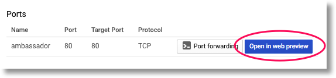

This will launch the Kubeflow dashboard in a new browser tab.

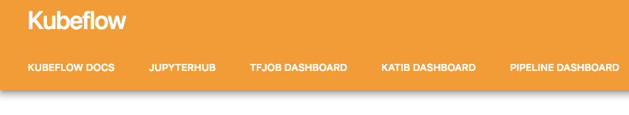

## Run a pipeline from the Pipelines dashboard
Duration: 20

### __Pipeline description__

The pipeline you will run has three steps:

1. It starts by training a  [Tensor2Tensor](https://github.com/tensorflow/tensor2tensor/) model using preprocessed data. (More accurately, this step starts from an existing model checkpoint, then trains for a few more hundred steps-- it would take too long to fully train it). When it finishes, it exports the model in a form suitable for serving by  [TensorFlow serving](https://github.com/tensorflow/serving/).
2. The next step in the pipeline deploys a TensorFlow-serving instance using that model.
3. The last step launches a web app for interacting with the served model to retrieve predictions.

### __Download and compile the pipeline__

To download the script containing the pipeline definition, execute this command:

    curl -O https://raw.githubusercontent.com/amygdala/code-snippets/master/ml/kubeflow-pipelines/samples/kubeflow-tf/gh_summ.py

Compile the pipeline definition file by running it:

    python3 gh_summ.py

You will see the file `gh_summ.py.tar.gz` appear as a result.

<aside class="special">

__Note: __If you get an error, make sure you have installed the Pipelines SDK and are using Python 3.
</aside>

### Upload the compiled pipeline

From the Kubeflow dashboard, click the __Pipeline Dashboard__ link to navigate to the Kubeflow Pipelines web UI. Click on __Upload pipeline__, and select __Import by URL__. Paste in the following URL, which points to the same pipeline that you just compiled.

[https://github.com/amygdala/code-snippets/raw/master/ml/kubeflow-pipelines/samples/kubeflow-tf/gh_summ.py.tar.gz](https://github.com/amygdala/code-snippets/raw/master/ml/kubeflow-pipelines/samples/kubeflow-tf/gh_summ.py.tar.gz) 

Give the pipeline a name (e.g. `gh_summ`).

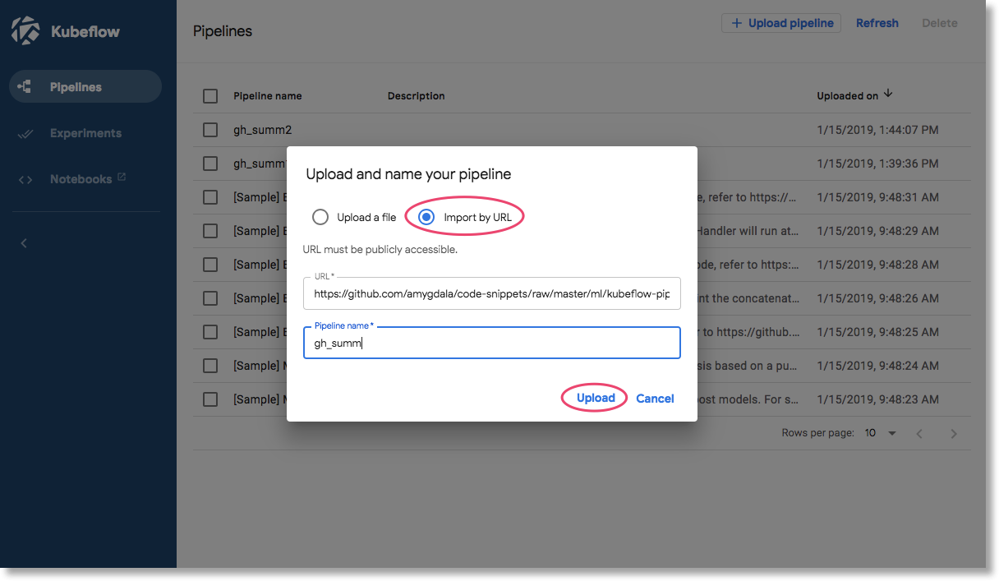

### __Run the pipeline__

Click on the uploaded pipeline in the list —this lets you view the pipeline's static graph— then click on __Start an experiment__ to create a new __Experiment__ using the pipeline.

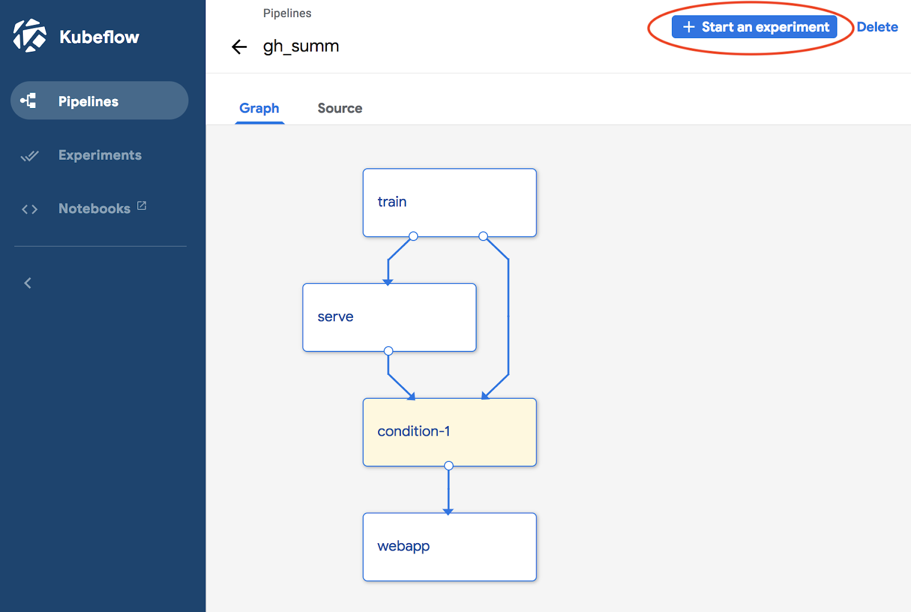

Give the Experiment a name (e.g. the same name as the pipeline, `gh_summ`), then click __Next__ to create it.

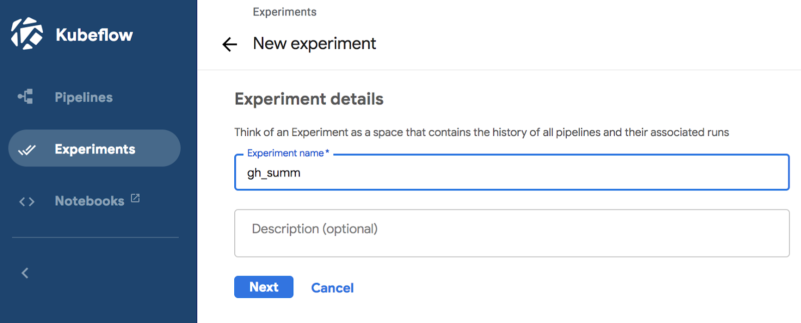

An Experiment is composed of multiple __Runs__. In Cloud Shell, execute these commands to gather the values to enter into the UI as parameters for the first __Run__:

    gcloud config get-value project
    echo ${GITHUB_TOKEN}
    echo "gs://${BUCKET_NAME}/kubecon"

Give the Run a name (e.g. gh_summ-1) and fill in three parameter fields: 

* project
* github-token
* working-dir

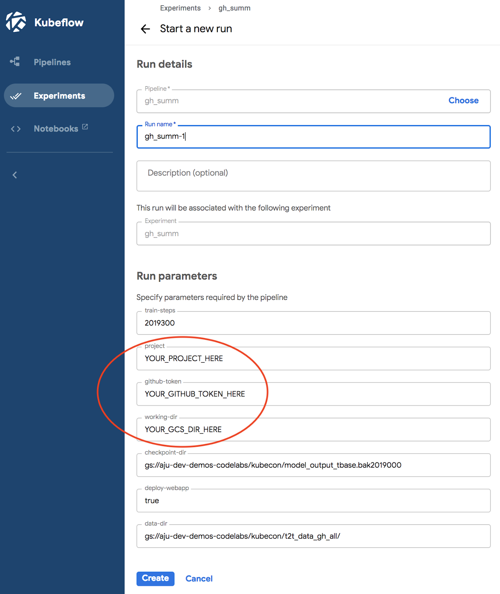

After filling in the fields, click Create.

<aside class="special">

__Note: __The pipeline will take approximately 15 minutes to complete
</aside>

Once the pipeline run is launched, you can click on an individual step in the run to get more information about it, including viewing its pod logs.

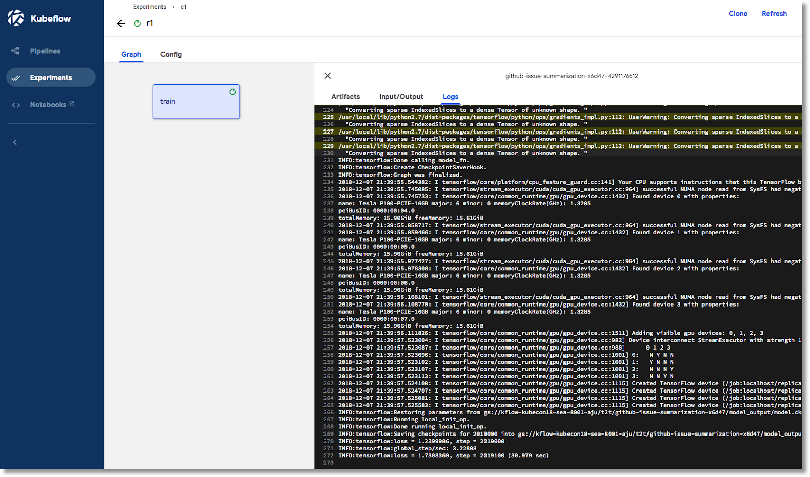

### __View the pipeline definition__

While the pipeline is running, take a  [closer look](https://github.com/amygdala/code-snippets/blob/master/ml/kubeflow-pipelines/samples/kubeflow-tf/gh_summ.py) at how it is put together and what it is doing.

### __View TensorBoard__

The first step in the pipeline performs training and generates a model. Once this step is complete, view __Artifacts__ and click the blue Start TensorBoard button, then once it's ready, click __Open Tensorboard__.

<aside class="special">

__Note: __If after a minute or so the startup status "spinner" appears to be stuck, try reloading the page.
</aside>

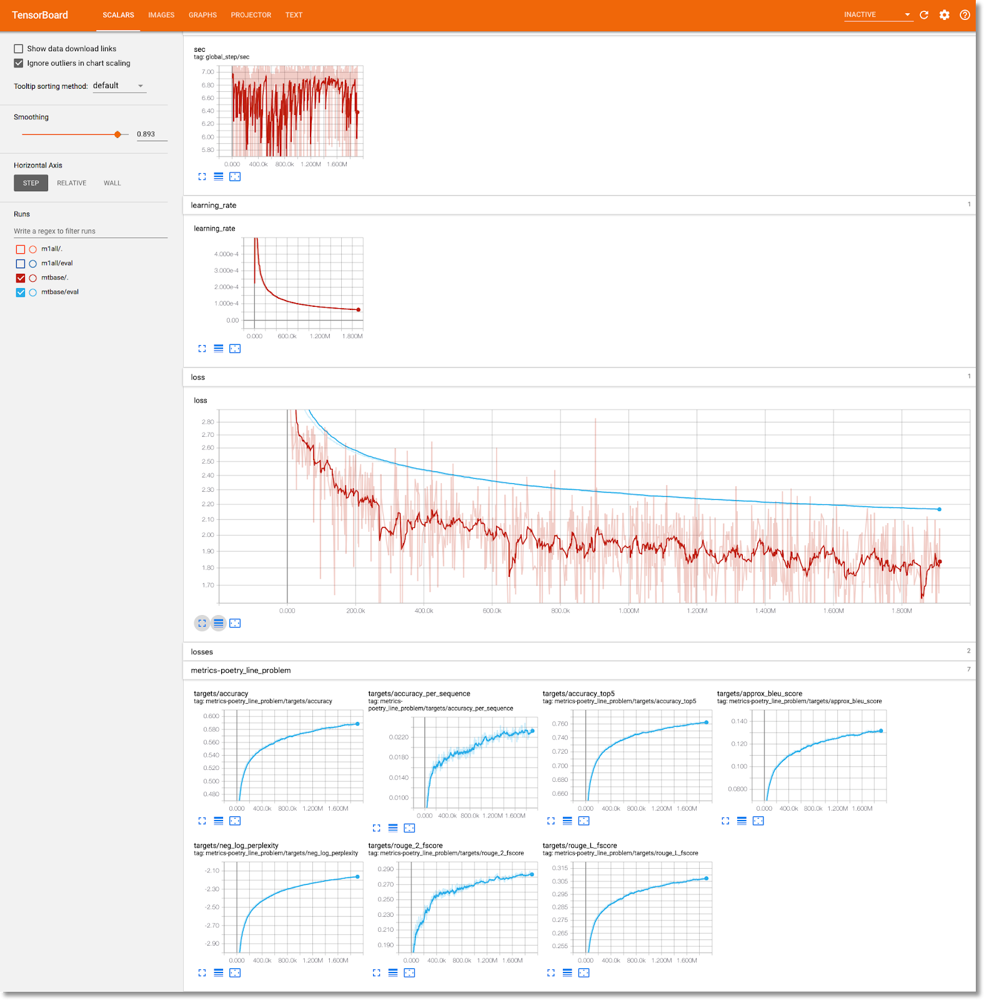

### __View the web app and make some predictions__

The last step in the pipeline deploys a web app, which provides a UI for querying the trained model - served via  [TF Serving](https://github.com/tensorflow/serving/) - to make predictions. After the pipeline completes, connect to the web app by visiting the Kubeflow central dashboard page, and appending __`/webapp/`__ at the end of the URL. (The trailing slash is required).

You should see something like this:

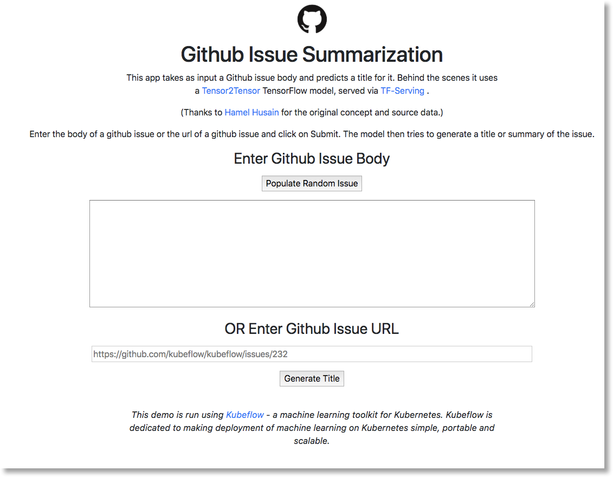

Click the __Populate Random Issue__ button to retrieve a block of text. Click on __Generate TItle__ to call the trained model and display a prediction.

<aside class="special">

__Note: __It can take a few seconds to display a summary— for this workshop we're not using GPUs for the TensorFlow Serving instance.
</aside>

### __If you have trouble setting up a GPU node pool or running the training pipeline__

If you have any trouble running the training pipeline, or if you had any issues setting up a GPU node pool, try this shorter pipeline.  It uses an already-exported TensorFlow model, skips the training step, and takes only a minute or so to run. Download the Python pipeline definition here:

[https://raw.githubusercontent.com/amygdala/code-snippets/master/ml/kubeflow-pipelines/samples/kubeflow-tf/gh_summ_serve.py](https://raw.githubusercontent.com/amygdala/code-snippets/master/ml/kubeflow-pipelines/samples/kubeflow-tf/gh_summ_serve.py) 

or the compiled version of the pipeline here:

[https://github.com/amygdala/code-snippets/blob/master/ml/kubeflow-pipelines/samples/kubeflow-tf/gh_summ_serve.py.tar.gz?raw=true](https://github.com/amygdala/code-snippets/blob/master/ml/kubeflow-pipelines/samples/kubeflow-tf/gh_summ_serve.py.tar.gz?raw=true) 

## Run a pipeline from a Jupyter notebook
Duration: 20

### __Create a JupyterHub instance__

You can also interactively define and run Kubeflow Pipelines from a Jupyter notebook. To create a notebook, navigate to the __JupyterHub__ link on the central Kubeflow dashboard.

The first time you visit JupyterHub, you'll first be asked to log in. You can use any username/password you like (remember what it was).
Then you will be prompted to spawn an instance. Select the TensorFlow 1.12 CPU image from the pulldown menu as shown below. Then click the __Spawn__ button, which generates a new pod in your cluster.

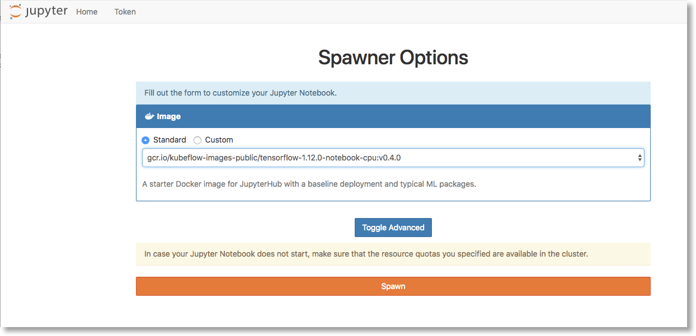

<aside class="special">

__Note: __JupyterHub will take 3-5 minutes to become available. You can view the status of the container on the Kubernetes Engine -> Workloads section of the GCP Console.
</aside>

### __Download a notebook__

Once JupyterHub becomes available, open a terminal.

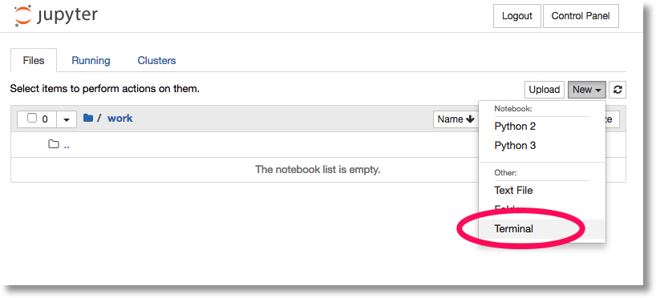

In the Terminal window, run:

    cd work
    curl -O https://raw.githubusercontent.com/amygdala/code-snippets/master/ml/kubeflow-pipelines/samples/kubeflow-tf/pipelines-kubecon.ipynb

Return to the JupyterHub home screen, navigate to the `work` folder, and open the notebook you just downloaded.

### __Execute the notebook__

In the Setup section, find the second command cell (starts with `import kfp`). Fill in your own values for the environment variables `WORKING_DIR`, `PROJECT_NAME`, and `GITHUB_TOKEN`, then execute the notebook one step at a time.

Follow the instructions in the notebook for the remainder of the lab.

## Clean up
Duration: 5

### __Destroy the cluster__

<aside class="special">

__Note: __Cluster deletion can take a few minutes to complete
</aside>

To remove all resources created by Click-to-Deploy, navigate to  [Deployment Manager](http://console.cloud.google.com/dm/deployments) in the GCP Console and delete the `$DEPLOYMENT_NAME` deployment.

### __Remove the GitHub token__

Navigate to  [https://github.com/settings/tokens](https://github.com/settings/tokens) and remove the generated token.

